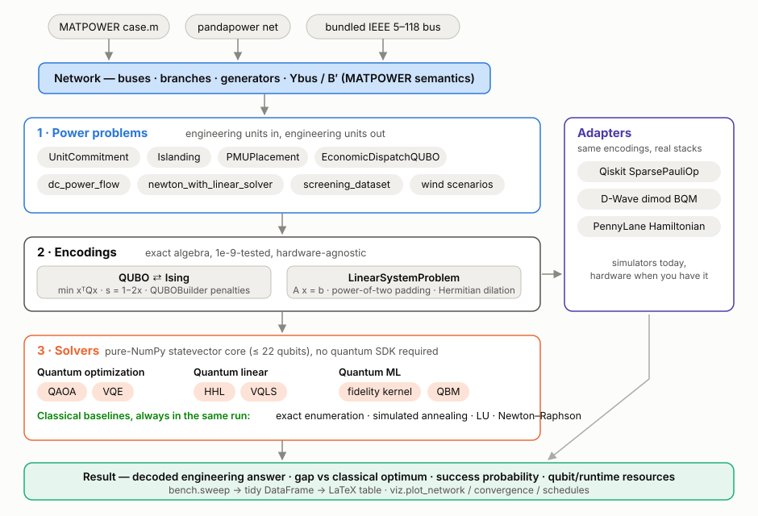
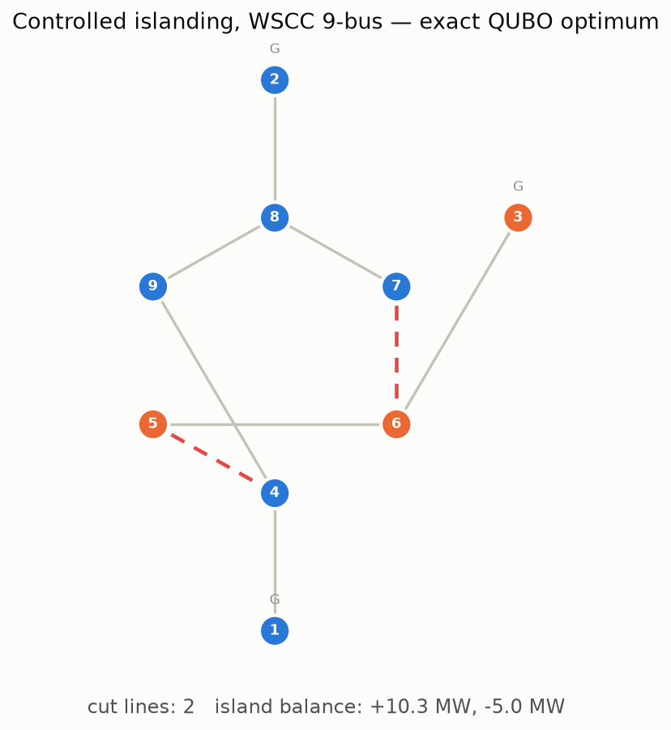
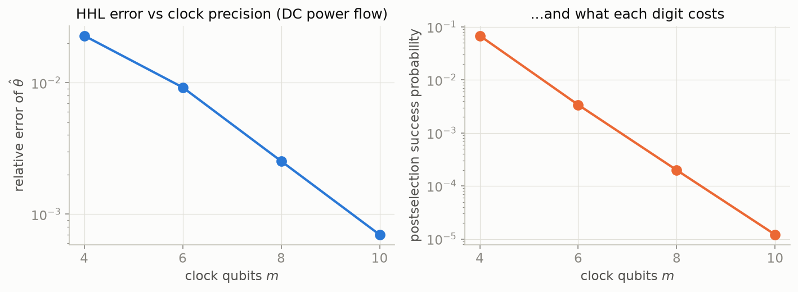

<p align="center">
  <picture>
    <source media="(prefers-color-scheme: dark)" srcset="docs/assets/logo-dark.svg">
    
  </picture>
</p>

<p align="center">
  <a href="https://github.com/TravisCao/qugrid/actions/workflows/ci.yml"></a>
  
  
  <a href="https://traviscao.github.io/qugrid/"></a>
</p>

**Quantum computing for power system research: from a MATPOWER case to a quantum algorithm in three lines.**

```python
import qugrid as qg

result = qg.solve(qg.problems.Islanding(qg.cases.case9()), solver="qaoa", seed=0)
print(result.summary())
```

QuGrid is for power system researchers who want to study quantum algorithms **without leaving their field's tools, units, and standards of evidence** — and for quantum researchers who want grid problems formulated the way power engineers will actually review them.

[English](README.md) · [中文](README.zh.md) · [Documentation](https://traviscao.github.io/qugrid/) · [10-min quickstart](https://traviscao.github.io/qugrid/quickstart/) · [十分钟上手](https://traviscao.github.io/qugrid/quickstart_zh/)

---

## Why this library exists

Between MATPOWER/pandapower and Qiskit/Ocean/PennyLane there is a gap where research quality goes to die: hand-rolled QUBO encodings with undocumented penalty weights, results reported as Ising energies instead of megawatts, and comparisons that quietly omit the classical solver the field actually uses. QuGrid closes that gap with three layers, each honest about what it does:

<p align="center"></p>

1. **Power problems** speak engineering units. `UnitCommitment`, `Islanding`, `PMUPlacement`, `EconomicDispatchQUBO`, `dc_power_flow`, N-1 `screening_dataset`, wind scenarios — built on a `Network` class that keeps MATPOWER column semantics, loads MATPOWER `.m` files directly, converts from pandapower, and bundles seven standard test cases (PJM 5-bus to IEEE 118-bus).
2. **Encodings** are exact, tested algebra: `QUBO ⇄ Ising` with pinned conventions, a `QUBOBuilder` with exact squared-penalty expansion for your own formulations, `LinearSystemProblem` with power-of-two padding and Hermitian dilation. The test suite enforces all of it at 1e-9.
3. **Solvers** run on a pure-NumPy statevector core — QAOA, VQE, HHL, VQLS, fidelity quantum kernels, a quantum Boltzmann machine — **with zero quantum SDK dependencies**, next to the classical baselines every claim must face: exact enumeration, seeded simulated annealing, LU, Newton–Raphson. The same problem objects export to Qiskit, D-Wave Ocean, and PennyLane when you want vendor stacks or hardware.

Every solver returns the same `Result`: the decoded engineering answer, feasibility of the *original* constraints (not the penalty proxy), the `gap()` to a classical reference computed in the same run, the success probability a hardware experiment would face, and the resource bill.

## Sixty seconds of evidence

Controlled islanding of the IEEE 9-bus system. The exact QUBO optimum opens 2 lines and leaves island imbalances of +10.3 / −5.0 MW; QAOA at depth 2 finds the same plan:

<p align="center"></p>

HHL on DC power flow, with the two numbers most papers do not print together — the error *and* what each digit of precision costs in postselection probability:

<p align="center"></p>

Numbers from the self-validating example scripts (each script asserts its own claims and exits nonzero if one stops holding):

| Study | Quantum result | Classical reference, same run |
|---|---|---|
| DC power flow, HHL @ 8 clock qubits | relative error 2.5e-3, max angle error 0.0067° | LU solution (exact) |
| Unit commitment, 2 units × 2 periods | exact QUBO = SA = \$2,908.00; discretization gap \$0.00 | UC enumeration: \$2,908.00 |
| Islanding, IEEE 9-bus | exact = SA = QAOA(p=2), gap 0 | exact enumeration |
| PMU placement, 9-bus / 14-bus | SA finds 3 / 4 PMUs, full observability | exact minimum: 3 / 4 |
| Quantum kernel on N-1 screening | test accuracy 1.00 at tuned bandwidth, 0.50 mistuned | RBF kernel: 1.00 |

## Install

```bash
pip install qugrid          # core: NumPy, SciPy, matplotlib, pandas — no quantum SDK
pip install "qugrid[all]"   # + qiskit, dwave, pennylane, pandapower adapters
qugrid demo                 # 30-second end-to-end check
```

## Choose your on-ramp

| You are… | Start here | Time |
|---|---|---|
| a power researcher, new to quantum | [quickstart](https://traviscao.github.io/qugrid/quickstart/) → [quantum primer written for you](https://traviscao.github.io/qugrid/primers/quantum-for-power/) → notebook 01 | 40 min |
| a quantum researcher, new to grids | [power primer written for you](https://traviscao.github.io/qugrid/primers/power-for-quantum/) → notebook 02 | 40 min |
| here to run experiments | [cheatsheet](https://traviscao.github.io/qugrid/primers/cheatsheet/) → [example zoo](examples/) | now |
| 中文读者 | [十分钟上手](https://traviscao.github.io/qugrid/quickstart_zh/) · [README 中文版](README.zh.md) | 10 min |

Five executed notebooks take you from zero quantum knowledge to running your own studies — `notebooks/01_hello_qugrid` (15 min) through `05_qml_for_screening` (30 min), markdown-heavy, every term defined in power system vocabulary first. The [learning paths page](https://traviscao.github.io/qugrid/learning-paths/) sequences them for each background.

## The example zoo

Ten single-file studies in [`examples/`](examples/), in the spirit of CleanRL: self-contained, seeded, finished in minutes on a laptop, self-validating, each with its classical baseline in the same file. Copy one, swap in your case file, and you have the skeleton of a paper's experiment section.

| # | Study | # | Study |
|---|---|---|---|
| 01 | DC power flow via HHL: error anatomy | 06 | QAOA depth study on islanding |
| 02 | Unit commitment via QAOA, honest success probabilities | 07 | Seed-swept solver benchmark → LaTeX table |
| 03 | Controlled islanding of the 9-bus system | 08 | Quantum kernel vs RBF on N-1 screening |
| 04 | PMU placement with slack-bit inequality encoding | 09 | Quantum Boltzmann machine wind scenarios |
| 05 | What discretization costs: encoding vs solver error | 10 | Hybrid Newton–Raphson with a variational linear solver |

## The honesty box

> **No quantum device today beats tuned classical solvers on any power system problem, and this library will never imply otherwise.** DC power flow is solved by sparse LU in microseconds; national-scale unit commitment is solved by MIP nightly. What QuGrid makes easy is the research that is real in 2026: encoding costs, error anatomy, resource scaling, algorithm behavior under discretization — always with the classical baseline in the same table. The [honest benchmarking guide](https://traviscao.github.io/qugrid/honest-benchmarking/) is the six-rule version of this paragraph; the API enforces most of it by default.

## Positioning

- **Qiskit Optimization, OpenQAOA, D-Wave Ocean** consume abstract QUBOs. QuGrid owns what happens before (credible grid formulations, documented penalty weights, discretization accounting) and after (decoding to MW, feasibility of the real constraints, field-standard baselines) — and exports to all three in one call.
- **MATPOWER and pandapower** stay the source of truth for grid data and classical power flow; QuGrid consumes their formats rather than replacing them.
- **CleanRL and Tianshou** inspired the shape: a small tested core plus single-file, self-validating research scripts.

## Citing

If QuGrid supports your research, cite it via [`CITATION.cff`](CITATION.cff) (GitHub's "Cite this repository" button) — and cite the algorithm papers referenced in each solver's docstring; HHL, QAOA, VQLS, and the quantum power flow literature are their authors' contributions, not this library's.

## Contributing

The highest-value contribution is a problem formulation from your own research: one file, one test, and every solver, benchmark, and plot in the library applies to it automatically. See [CONTRIBUTING.md](CONTRIBUTING.md) and the [formulation proposal template](.github/ISSUE_TEMPLATE/formulation_proposal.yml).

## License

MIT. Bundled test case data derives from [MATPOWER](https://matpower.org/) test cases (BSD 3-clause).
